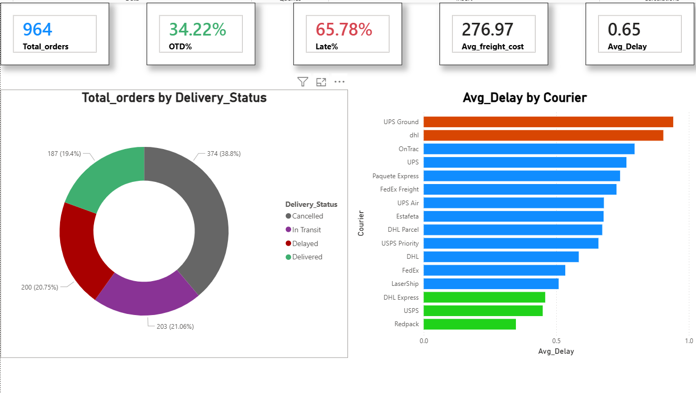

# 🚚 Hunter Shipping KPI Dashboard | Power BI

Executive logistics dashboard to track On-Time Delivery, late shipments & carrier performance.

## 📸 Preview

## 📊 KPIs Tracked
- Total Shipments
- On-Time Delivery % (OTD)
- Late Shipments
- Avg Delivery Days
- Best vs Worst Carrier (Red=Bad, Green=Good)

## 📁 How to Open (Important for Recruiter)
1. Download `Hunter power BI project.pbip` + `Hunter_Project_Files.zip`
2. Right-click ZIP -> Extract All -> Put extracted folders in same place as .pbip file
3. Double-click .pbip file to open in Power BI Desktop

## 🛠️ Tech Stack
Power BI Desktop (PBIP format), DAX, Power Query

## ✨ Features
- 5 Uniform KPI Cards
- OTD Donut with % labels
- Carrier Performance Bar (Conditional formatting)

Author: Glorisprema | Supply Chain Analyst
